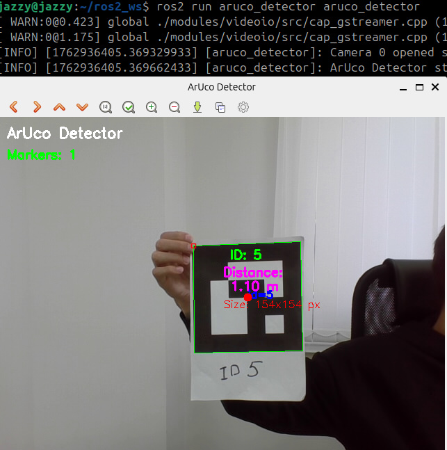

# Aruco detector



## Простой детектор меток аруко. Распознает метку аруко, обводит её границы зеленым цветом, распознает айди и выводит на экран айди. Так же рассчитывает размер в пикселях для метки и расстояние до нее в метрах (до сотых долей)

## Размер метки задан жестко 0.17 (17 см)

сборка запуск

```bash
colcon build --packages-select aruco_detector
source install/setup.bash
ros2 run aruco_detector aruco_detector
```

Источник https://www.instructables.com/Distance-Estimation-Using-Opencv-and-ArUco-Marker/
